# Chaos Hoodie
## Introduction
### What is this project?
Hello and welcome to my tutorial for making the Chaos Hoodie! 

The Chaos Hoodie is an e-textiles projt designed to produce an unpredictable lighting and and sound display using sensor input and randomized behavior. The system is built using an Adafruit FLORA microcontroller alongside NeoPixels, Lilypad sewable LEDs, a Lilypad light sensor, a Lilypad buzzer and a ball bearing tilt sensor. 

Instead of responding to sensor values in a predictable way by directly mapping sensor input to actuator output, this project instead uses the sensors to generate randomness. Sensor readings from the light sensor and tilt sensor are used to continously calculate a random seed, which then directly affects the output of Arduino's `random()` function. The random values generated by this function are used to control the behavior of the LEDs and buzzer, creating a constantly changing and chaotic audiovisual display.

The result is a wearable device that behaves completely differently every time it runs while still reacting subtly to its environment.

### Who is this project for?
This project is great for makers, students learning about e-textiles and hobbyists whop have a general interest in e-textiles and wearable electronics. This project will also be particularly interesting to people who enjoy experimental design where the system produces emergent or unpredictable behavior rather than predictable outputs.

This project is something you could take to a rave or show off to friends as it responds to both the environment through the light sensor and movement through the tilt sensor where actions like jumping or hopping will shift the ball bearing and influence the random seed. It is important to note that this is a **CHAOS** hoodie meaning the behavior is meant to be as random as possible without completely disregarding sensor input. As a result of this focus on chaos, the buzzer attached to the system plays completely random tones during each loop of the code, if you find this to be too annoying, alternatives for the buzzer behavior are discussed in the [Reviewing the Code](#reviewing-the-code) section.
### Estimated time to complete
Before you go any further, please keep in mind that the construction of this project could take you anywhere between **8 and 13 hours**. This number only takes into account the actual construction of the Chaos Hoodie and no other factors such as testing, writing code, or debugging incorrect behavior.
### Washability
Because this project utilizes many electronic components, it **cannot be machine washed** during or after construction if not extra steps are taken to protect the components. Even if you decide to add extra protection like clear nail polish or some sort of adhesive or resin, I still highly reccomend you hand wash the hoodie because none of the components besides the battery can be removed. Hand washing the hoodie allows you to be extra careful not to get some of the more sensitive components like the buzzer wet, which would be damaged if gotten wet. 

Once you are done handwashing give plenty of time for all the components to **fully dry** before powering up the system again.
### Estimated battery life
There are numerous ways to power the Chaos Hoodie as the Adafruit FLORA accepts a JST connection meaning you could use Adafruit's AA or AAA battery holders or a rechargeable LiPo battery. Battery life will depend on both the size of your battery, the brightness of all of the LEDs and how often the buzzer is activated.

The NeoPixels will be the most power hungry componentsa in the system. A single NeoPixel can draw up to **60 mA at full brightness**, althrough in this project the LEDs will typically be running at lower brightness levels a majority of the time.

With **5 NeoPixels** including the FLORA's onboard NeoPixel, the estimated maximum current draw of the system is:
- NeoPixels: Up to ~300 mA
- FLORA microcontroller: ~20 mA
- Sewable LEDs: Up to ~80 mA depending on brightness
- Buzzer: ~20 mA

Total: **420 mA**

These 4 components have the most noticeable power draw but please keep in mind the total is a rough estimate of the high-end of the possible power draw. Keeping all of these values in mind we can assume that a 1200mAh LiPo battery could run this system nonstop for approximately **2-3 hours**.
### Skills required
This project assumes beginner to intermediate experience with sewing, basic electronics and Arduino programming.

Helpful skills include:
- Basic Arduino programming.
- Undertanding digital vs analog pins.
- Basic sewing using both conductive and non-conductive thread.
- Uploading code written in Arduino to a microcontroller compatible with Arduino.
- Simple understanding of circuits.

No advanced skills are required, but the more baseline knowledge you have, the smoother this project will go. Also, being familiar with coding in Arduino will make it for easier for you to make your own personal modifications to the code should you not like some aspects of the system's behavior. 
### Tools required
Below is a list of tools that will be used for this project:
- Computer with the Arduino IDE installed.
- Micro-USB cable that can plug into your computer to upload code to the FLORA.
- Sewing needles.
- Scissors or some other sharp object for cutting thread.
- **Optional** - Tape or some sort of adhesive for initial attachment of components to the garment.
- **Optional** - Multimeter for testing conductive thread connections.
- **Optional** - Alligator clips for testing components.
## Materials
Below is a list of all the materials used in the construction of the project.

| Component | Quantity | Estimated Cost | Link |
|:---------:|:--------:|:--------------:|:----:|
| Adafruit FLORA microcontroller | 1 | $14.95 | https://www.adafruit.com/product/659 |
| NeoPixels | 4 | $6.50 | https://www.adafruit.com/product/1260 |
| LilyPad light sensor | 1 | $5.25 | https://www.sparkfun.com/lilypad-light-sensor.html |
| Ball bearing tilt sensor | 1 | $2.50 | https://www.sparkfun.com/tilt-sensor-at407.html |
| LilyPad sewable LEDs | 1 set | $4.75 | https://www.sparkfun.com/lilypad-rainbow-led-6-colors.html |
| LilyPad buzzer | 1 | $5.25 | https://www.sparkfun.com/lilypad-buzzer.html |
| Battery compatible with FLORA | 1 | $2.95 – $14.95 | https://www.adafruit.com/product/4779 |
| Conductive thread | 1 spool | $4.50 | https://www.adafruit.com/product/603 |
| Sewing needles | 1 pack | $1.95 | https://www.adafruit.com/product/615 |
| Standard sewing thread | 1 spool | $5.00 – $15.00 | https://www.amazon.com/s?k=sewing+thread |

**Estimated Total Cost:** $53.60 – $75.60

Additional recommended materials not listed above include tape, glue, clear nail polish, a multimeter or alligator clips, which can be useful for reinforcing or testing conductive thread connections during or after construction.
## Prepare for Construction
There is some important information you have to know before construction begins so you can avoid making critical mistakes. Shown below is a pinout diagram for the Adafruit FLORA:

<em>Figure: Adafruit FLORA pinout diagram.</em>
Source: <a href="https://learn.adafruit.com/getting-started-with-flora/flora-pinout-diagram">Adafruit FLORA Pinout Diagram</a>

The FLORA contains several types of pins that serve different purposes:
- **Digital pins** are used to control components such as the LEDs and the buzzer, they also read in the state of the tilt sensor.
- **Analog pins** are used to read variable sensor values, which in our case are provided by the light sensor.
- Some pins also support **PWM (Pulse Width Modulation)** which allows use to control the brightness of the Lilypad sewable LEDs.

For this project every component will need a connection to ground as well as a connection to specific types of pins for power and signal:
- The **light sensor** will be connected to analog pin **A10** and will get its power from one of the **3.3V** pins.
- The **tilt sensor** will be connected to digital pin **D3** and does not need an extra power connection.
- The **NeoPixels** will be connected to digital pin **D12** and will get their power from the **VBATT** pin.
- The **Lilypad sewable LEDs** will be connected to digital pin **D9** which was **PWM** capability and will get their power from one of the **3.3V** pins.
- The **Lilypad buzzer** will be connected to digital pin **D1** and does not need an extra power connection.

If you follow the construction guide step by step you won't have to worry about the layout of the components, but if you want to be more freeform please keep in mind what types of pins each component needs its signal and power from. Also keep in mind that ground pins can be shared between components.

Finally, gather all of your components and tools and select a hoodie OR shirt if you'd like to become your CHAOS Hoodie (or shirt).

## Construction Guide
### Step 1 - Organize components on the hoodie and be aware of final component placement:
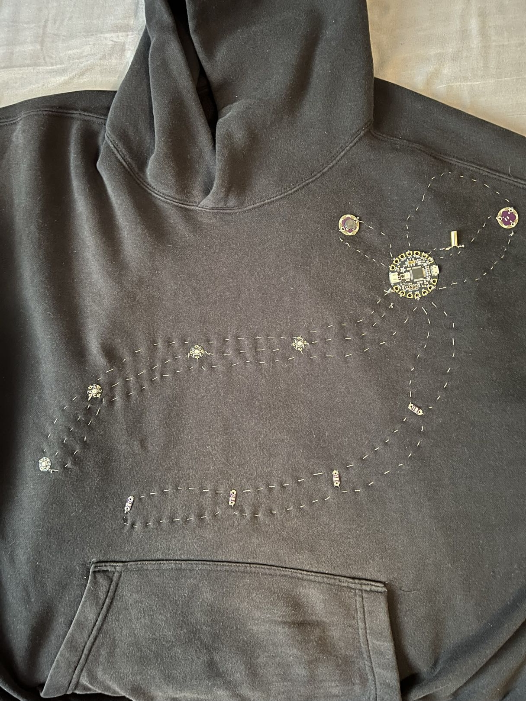

Shown here is the final layout of all of the components. Im showing you this first so you're aware of the complete layout in case you find any of the below steps confusing. You'll begin by placing the FLORA in the upper right quadrant of the front of the hoodie.
### Step 2 - Attach the FLORA and run power to the 1st NeoPixel:

    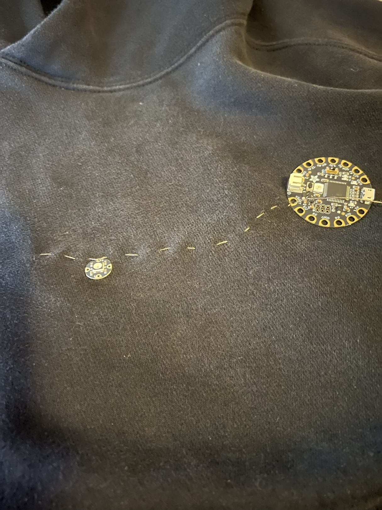
    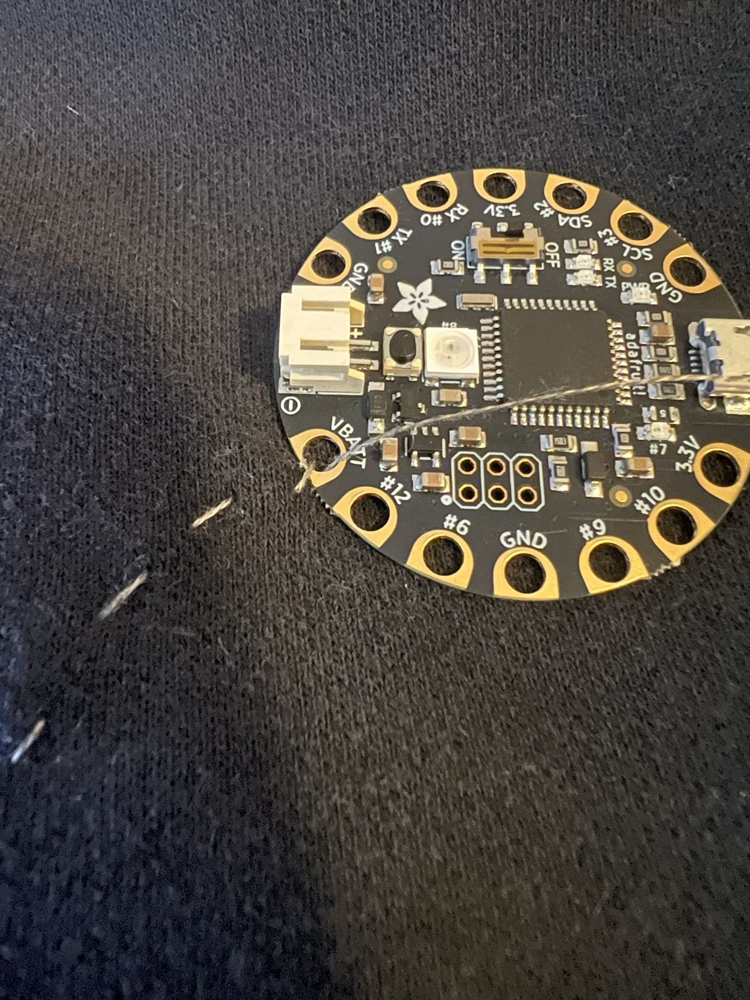

To get our FLORA attached to the hoodie, first make sure that the ground pin between pins #6 and #9 is facing down then begin by running the power from the VBATT pin to the + pin on the first NeoPixel. We will use one conductive thread line to connect the power to all of the NeoPixels, this means that you should **NOT** cut the conductive thread until you tie it off on the last NeoPixel in the chain. Do not worry about tying off the connection on the FLORA until all of the NeoPixels are attached. Finally, make sure the arrow on the NeoPixel is pointing towards where the next one will be attached and not the FLORA.

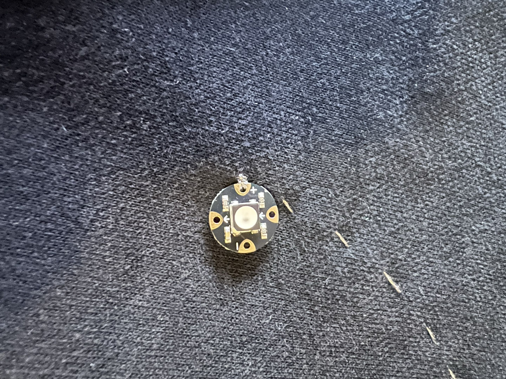

### Step 3 - Continue running the power to the rest of the NeoPixels:

    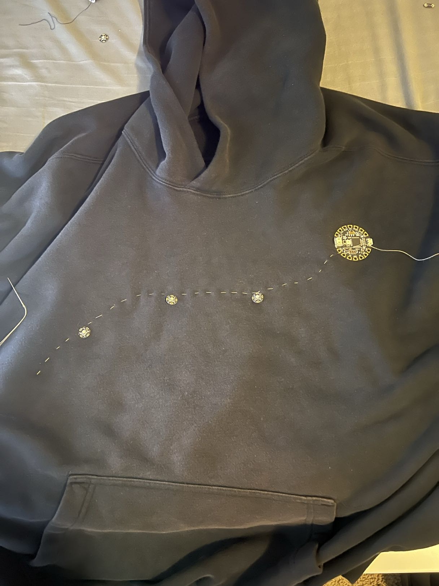
    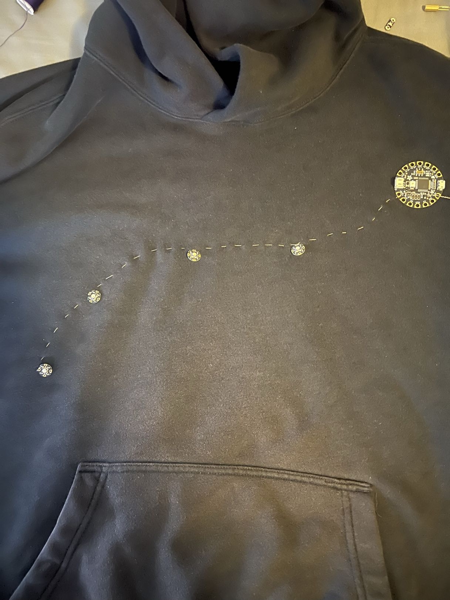

Continue routing the same line of conductive thread, looping through the + pin on each NeoPixel. I find that the closer you keep your stitches, the easier it is to avoid potential short circuits, especially with how close the signal and ground lines will be to the power line.

### Step 4 - Run the signal from the #12 pin to the first NeoPixel:
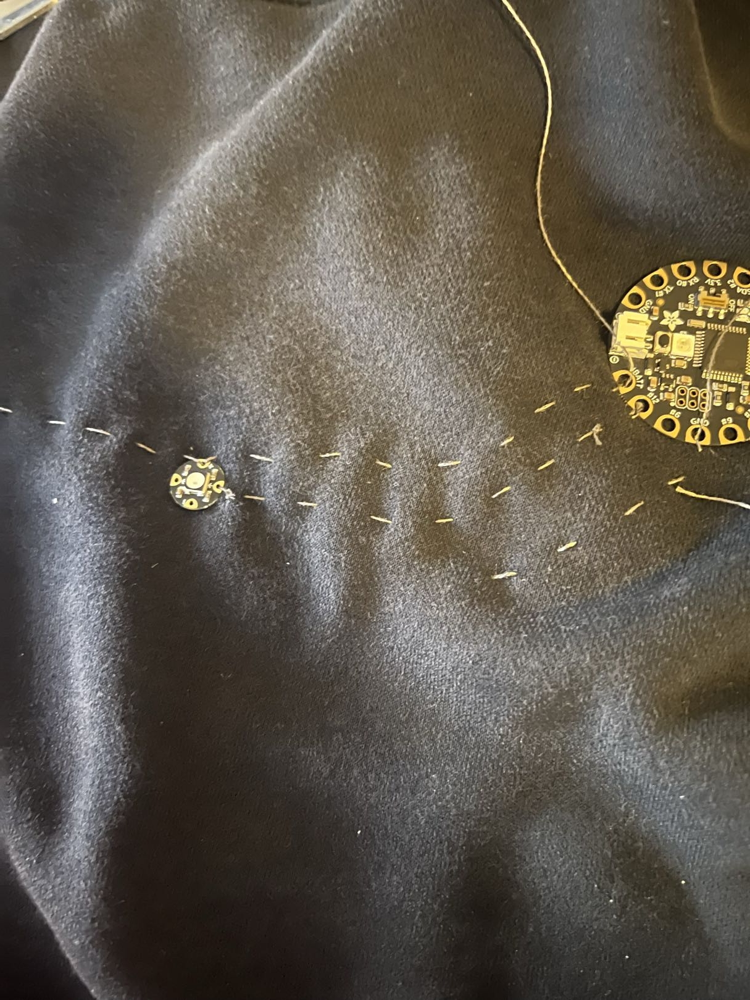

Now get your signal connection ran to the first NeoPixel, the signal is not a continous run and instead is jumpered between every NeoPixel. Remember, the signal pin should have an arrow pointing **towards** the next NeoPixel. Once we get the first signal line in, we'll pivot to get our entire ground line ran first.
### Step 5 - Run the ground line for the NeoPixels:
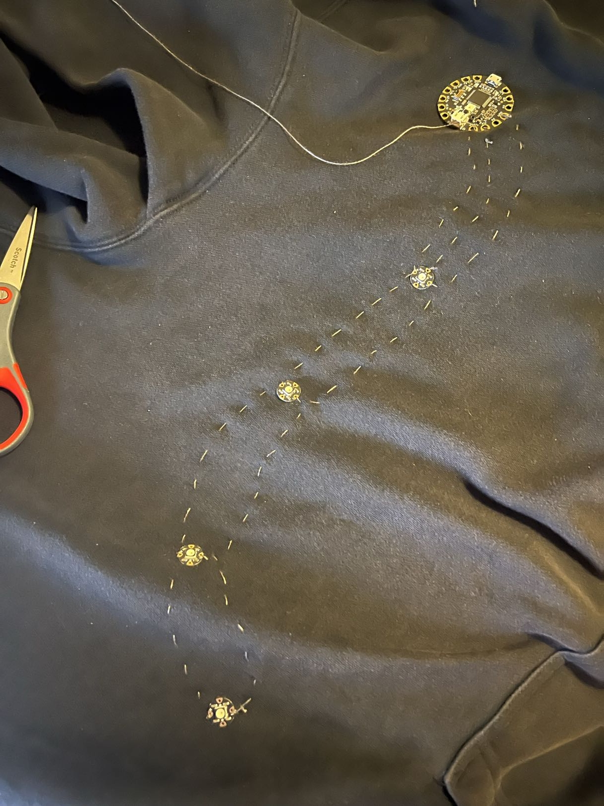

Running the ground is pretty much the exact same process as running the power, make sure that the ground for the NeoPixels is coming from the ground pin directly next to pin #6 on the FLORA. Run the ground making sure to loop through the - pin for each NeoPixel before tying it off on the last NeoPixel and cutting any loose thread short.
### Step 6 - Run the rest of the signal jumpers for the NeoPixels:
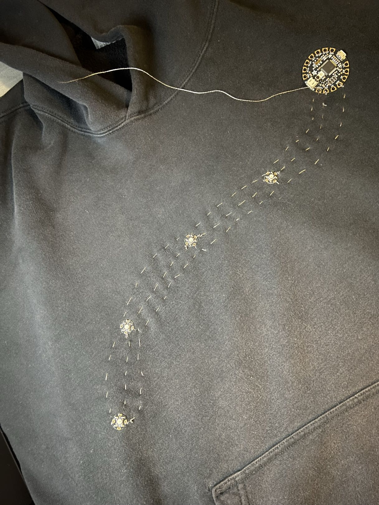

This process is a little different as instead you will be making three shorter runs for the signal jumpers between all 4 NeoPixels. Make sure you don't accidentally cross your conductive thread over the power or ground lines. If you keep your stiches neat and short you should have no problem avoiding the power and ground lines.
### Step 7 - Run signal and ground for the buzzer:

    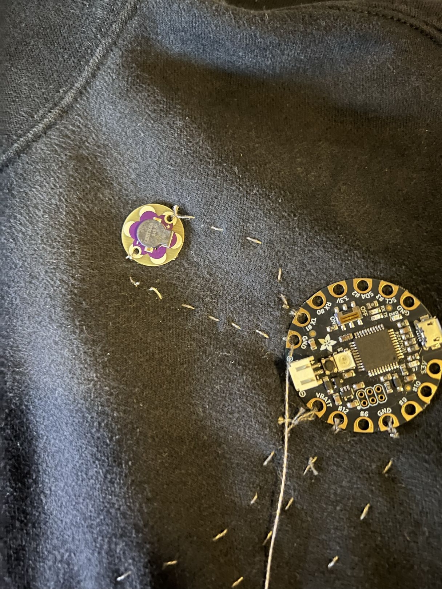
    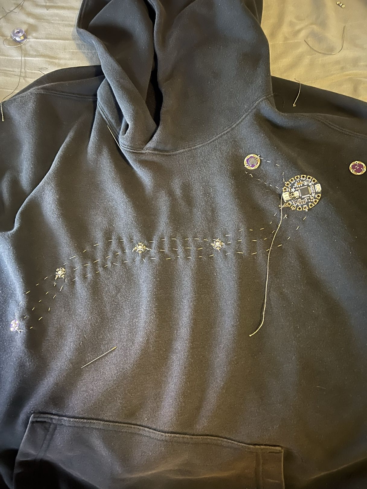

Next you will want to attach the buzzer to the hoodie. The buzzer should be oriented in a way that the ground is facing left and the signal or positive side if facing right. You should get your ground line from the ground pin directly next to the battery plug in on the board. Your power or signal should come from the TX pin which is directly next to the ground pin. Sow your lines for the buzzer being usre not to cross them in order avoid short circuits.

### Step 8 - Run signal and power for the light sensor:
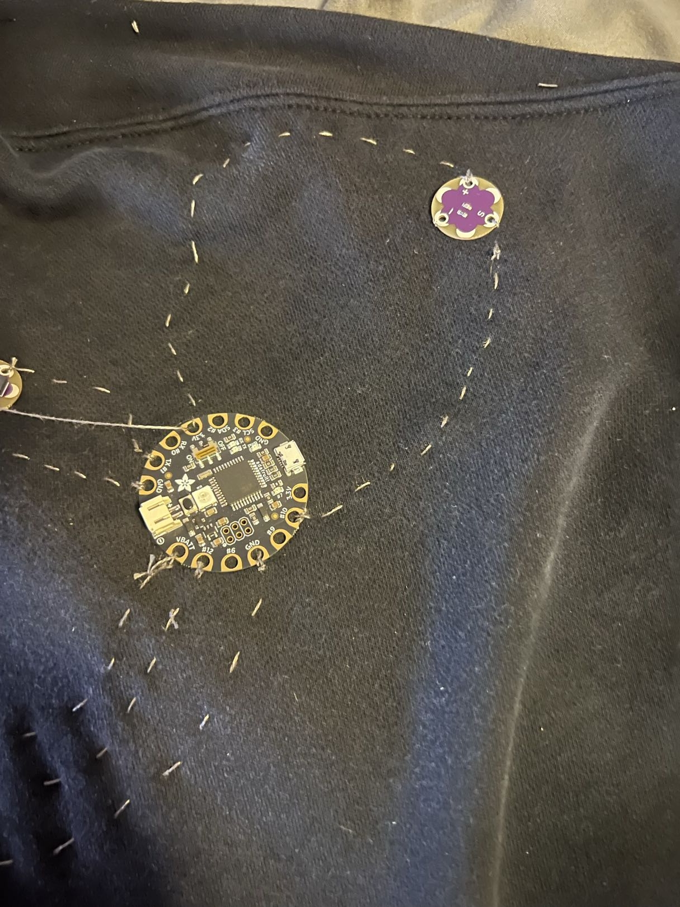

The signal for the light sensor will come from pin #10 on the FLORA while the power will come from the 3.3V pin situated between the SDA and RX pins. When you are sowing these connections in, make sure that you leave enough empty space like in the image above to attach your tilt sensor which will share a ground connection with the light sensor.
### Step 9 - Attach tilt sensor and run shared ground for tilt/light sensors: 
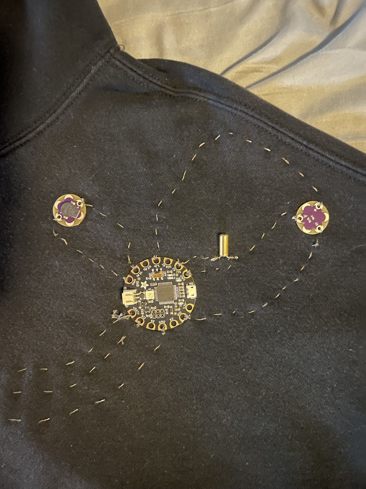

Spread the legs of your tilt sensors out directly away from one another. Then, try to create loops in the legs of the tilt sensor so you have a place to attach your conductive thread. It does not matter which leg of the tilt sensor gets signal or is connected to ground, but the legs should not be touching one another. In this case we get the signal for the tilt sensor from the SCL pin and the shared ground from the ground pin directly next to the SCL pin. 

When running the ground, make sure that you keep it spaced away from the signal line for the tilt sensor. The ground line should run to the other leg of the tilt sensor and then continue to connect to the - pin on the light sensor.
## Reviewing the Code
## Troubleshooting
## Conclusion